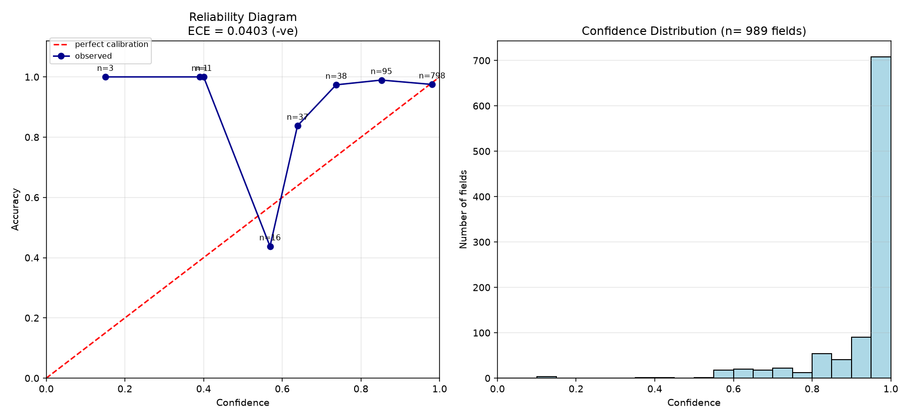

# Expected Calibration Error on OCR

We are calculating the ECE (Expected Calibration Error) on OCR.

The Interfaze API returns the per word level confidence and also the structured response. If we know the ground truth of the response then we can calculate the accuracy of the response. Since the API is also returning the per word confidence, we can trace back the confidence of each field in the structured response approximately.

## What is ECE?

If the model is saying 60% confidence then it should be accurate 60% of the time. But if it turns out that the model is accurate 75% of the time then we say the model is underconfident, and if the accuracy is 53% we say the model is overconfident.

ECE measures the gap between the model's confidence and the model's actual accuracy.

To calculate ECE we divide the confidence into 10 equal width bins:

```
bins = [0, 0.1, 0.2, ..., 0.9]
```

For each bin we calculate the mean accuracy and the mean confidence. Then we calculate the gap between the mean confidence and the mean accuracy in this bin:

```
abs(mean_confidence - mean_accuracy)
```

To calculate the overall ECE we take the weighted average of the gaps:

```
weight = number of data points in bin_i / total number of data points
```

Data points = list of `(field_name, ground_truth_value, predicted_value, confidence)`.

An ECE close to 0 means the weighted average of the gaps is very small, which means it is calibrated. It is giving confidence as per the actual accuracy. It is more reliable.

Higher ECE means less reliable.

ECE is in `[0, 1]`.

When we have an ECE of 0.12 we say its confidence can be off from its accuracy by 0.12. The signed version (that is, if we remove the abs above) will tell the direction:

- Positive means it is overconfident.
- Negative means it is underconfident.

Since it is signed, the opposite directions can cancel out, so it may be zero even when the ECE is not zero. This is a bad failure mode, as the model may be guessing the confidence.

## Dataset

The dataset we are using is the CORD dataset. It is a dataset of receipts.

Example receipt:


The dataset also provides the ground truth:

```json
{
  "menu": [
    {
      "nm": "Ash Chick Sambal Matah",
      "cnt": "5",
      "price": "75.000"
    },
    {
      "nm": "Jamur Goreng",
      "cnt": "2",
      "price": "10.000"
    }
  ],
  "sub_total": {
    "subtotal_price": "85.000",
    "tax_price": "8.500"
  },
  "total": {
    "total_price": "93.500",
    "cashprice": "100.000",
    "changeprice": "6.500"
  }
}
```

## Pipeline

- Iterate over the dataset.
- Send each receipt image to the Interfaze API with structured output enabled.
- For each field in the structured output, collect `(image_id, field_name, ground_truth_value, predicted_value, confidence)`.
- Assumption: the Interfaze API returns the per word confidence in the precontext, and the parsed response separately. So to calculate the confidence of a field, we split the field text into words and look up each word in the precontext. If a word occurs more than once, we take the minimum confidence among those occurrences. That gives us one confidence per word, and we take the minimum across all the words of the field as the confidence of the field itself.
- We have done a loose comparison between the ground_truth_value and the predicted_value, ignoring common misinterpretations of text (whitespace, `,`, `.`).
- Then calculate the ECE as discussed above.

Hence we will get a list of `(image_id, field_name, ground_truth_value, predicted_value, confidence)`. Each element in this list is what we are calling a field.

## Observation

We have taken a subset of the dataset (test split) and run the above pipeline.

Note: the subset is small and contains only 100 images, which give 989 fields.

The raw OCR API responses for the CORD dataset used, from which the above metrics are calculated, are present at [assets/interfaze_ocr_results](assets/interfaze_ocr_results).

We have found the ECE to be **0.04026**, which means that on average the model's accuracy is off from its confidence by about 4 percentage points. Signed: **-0.02689**, and hence negative, so slightly underconfident.

It means the API as a whole is slightly underconfident with a gap of 0.04 on average.



Above figure:

- On the left side is the reliability diagram. Basically it is a plot of the mean confidence and the mean accuracy per bin, along with the number of fields occurring in those regions. The `y = x` line on the chart shows perfect calibration, as the confidence is the same as the accuracy on that line.
- On the right side is the confidence distribution, basically how many data points occur at a given confidence range.

The mid range bins are above the calibration line, so the API is underrating itself there. But the 0.9 to 1.0 bin holds 798 of the 989 fields and is a little overconfident (0.981 mean confidence in the 0.9 to 1.0 bin versus 0.975 mean accuracy).

The overall accuracy is **0.9626**.

## Limitations

- The subset is small.
- It is skewed: 798 of the 989 fields land in the 0.9 to 1.0 bin.

